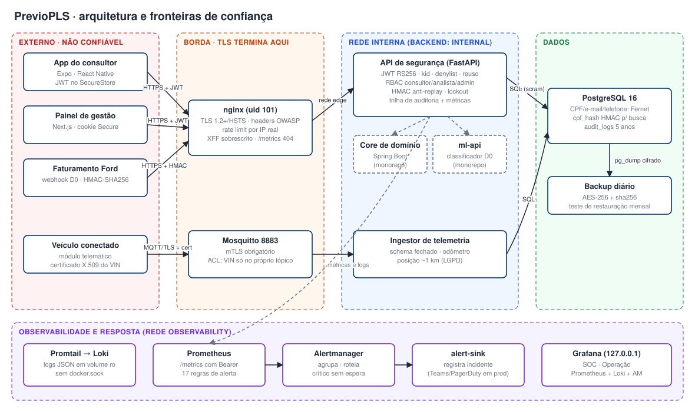
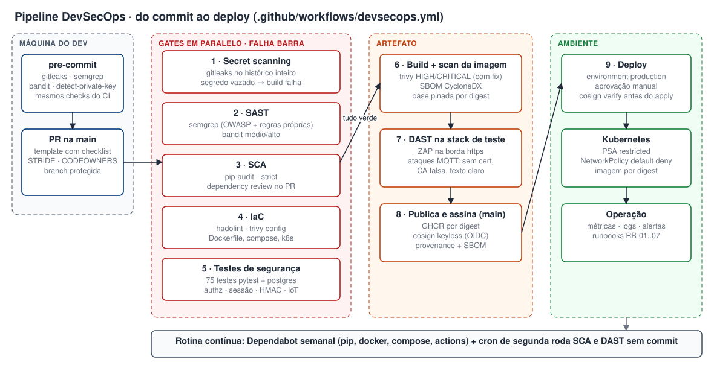
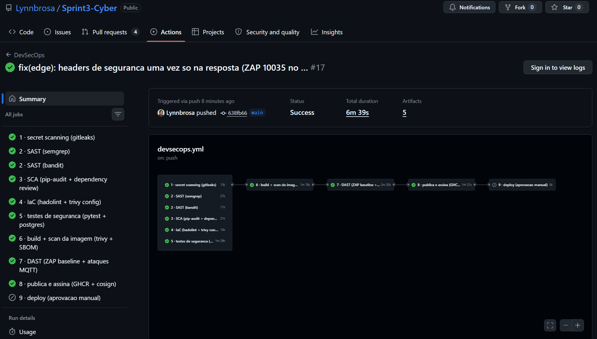
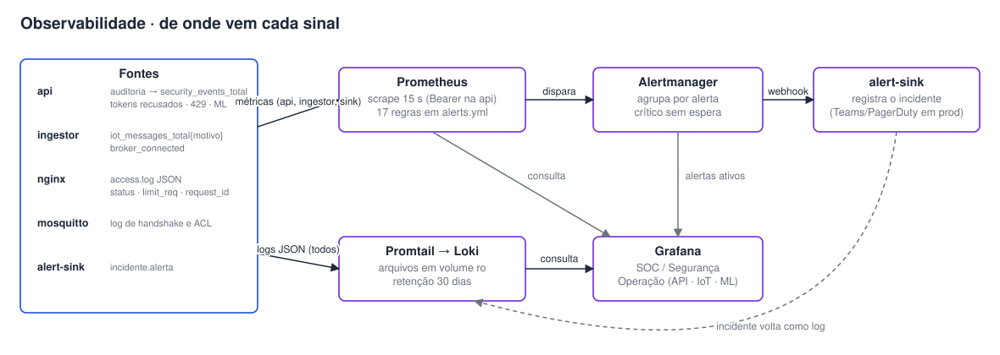
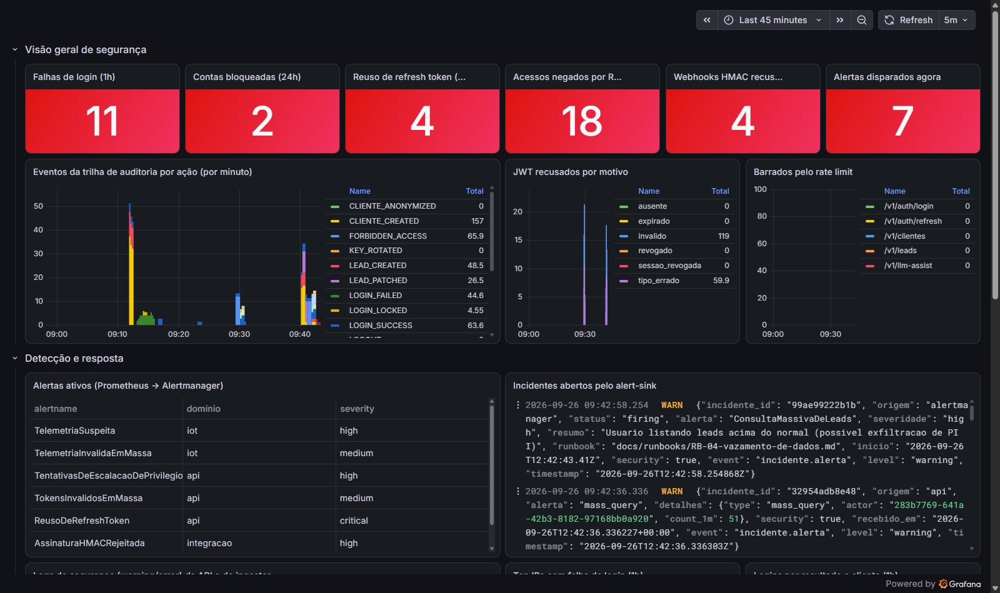
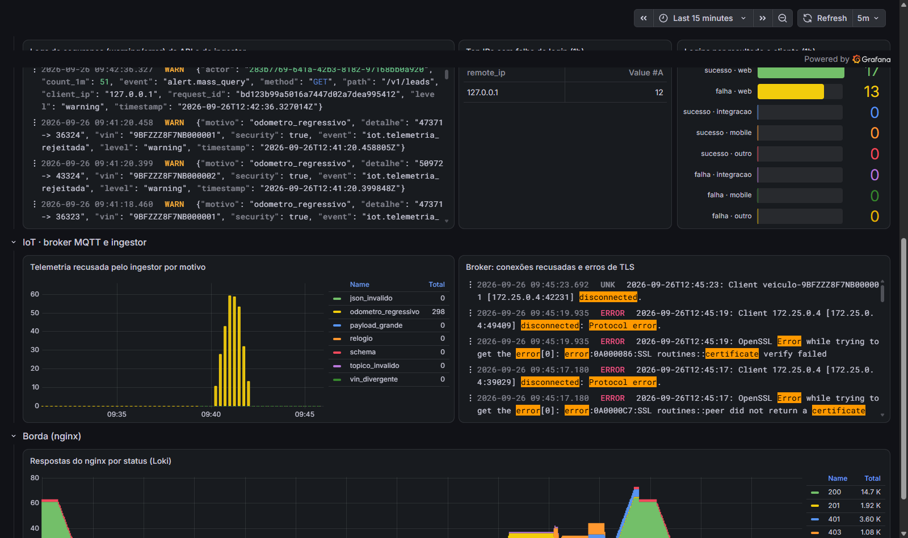
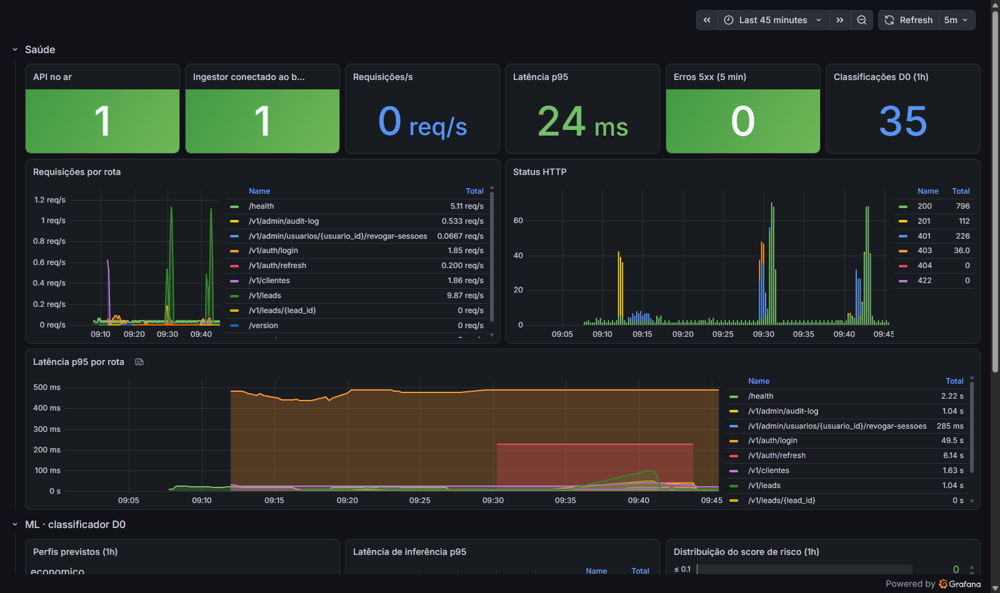
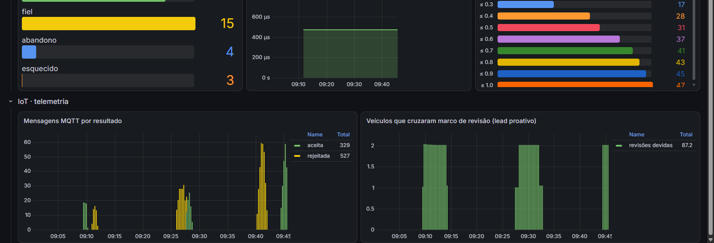
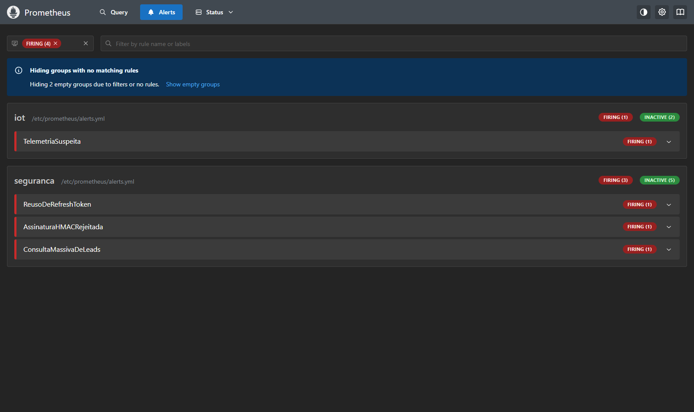
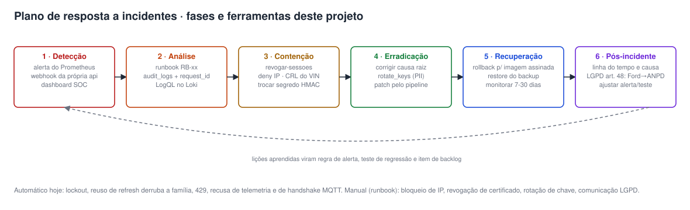

# PrevioPLS · Sprint 3 · Cybersecurity — DevSecOps

**Challenge FIAP 2026 · Ford — Desafio 02 (VIN Share / retenção pós-venda)**

| Integrante | RM |
|---|---|
| Giovanne Charelli Zaniboni Silva | 556223 |
| Gustavo Oliveira de Moura | 555827 |
| Lynn Bueno Rosa | 551102 |

Documento único da entrega, separado pelas quatro atividades da rubrica:

| # | Atividade | Peso | Seção |
|---|---|---|---|
| 1 | Pipeline DevSecOps integrado | 3,0 | [§1](#1-pipeline-devsecops-integrado-peso-30) |
| 2 | Segurança em código e infraestrutura | 2,5 | [§2](#2-seguranca-em-codigo-e-infraestrutura-peso-25) |
| 3 | Observabilidade, monitoramento e resposta | 2,0 | [§3](#3-observabilidade-monitoramento-e-resposta-peso-20) |
| 4 | Compliance, riscos e segurança contínua | 2,5 | [§4](#4-compliance-riscos-e-seguranca-continua-peso-25) |

Tudo o que está aqui foi **executado** na stack deste repositório em 26/09/2026. Os números vêm dos
arquivos em [`docs/evidencias/`](evidencias/), e cada correção de código tem um commit próprio
no histórico git (lista completa no [Anexo A](#anexo-a--historico-de-commits)).

---

## 0. Contexto e escopo

O PrevioPLS classifica o comprador de um Ford no momento da compra (D0) em quatro perfis
(fiel, econômico, esquecido, abandono) e gera leads priorizados para o consultor da concessionária
agir antes que o cliente deixe a rede oficial. A solução completa tem API, app mobile do consultor,
painel web, classificador de ML e, nesta sprint, **telemetria de veículo conectado** (odômetro e
códigos de falha OBD-II), que alimenta leads de revisão proativa.

Este repositório concentra a camada de segurança: a **API de segurança** (FastAPI, borda LGPD do
monorepo PrevioPLS), o **ingestor de telemetria MQTT**, a infraestrutura como código e o pipeline.
O core de domínio (Spring Boot), o app (Expo) e o painel (Next.js) vivem no monorepo e entram
aqui como parte do modelo de ameaças, do mapeamento OWASP e do desenho do pipeline.



| Zona | Componentes | O que protege a fronteira |
|---|---|---|
| Externo (não confiável) | app do consultor, painel, faturamento Ford, veículo | nada é confiável: tudo autentica |
| Borda | nginx sem root, Mosquitto 8883 | TLS 1.2+, rate limit por IP real, mTLS e ACL por VIN |
| Rede interna | API, ingestor, core, ml-api | JWT RS256 + RBAC, HMAC, validação de schema |
| Dados | PostgreSQL, backup | PII cifrada (Fernet), rede `internal` sem rota pra fora, backup AES-256 |
| Observabilidade | Prometheus, Alertmanager, Loki, Grafana | só em 127.0.0.1, `/metrics` com Bearer |

**Perfis de acesso.** A rubrica cita Brigadista, Gestor e Administrador como exemplo. No
PrevioPLS os perfis equivalentes são:

| Exemplo da rubrica | Perfil no PrevioPLS | Quem é | Pode |
|---|---|---|---|
| Brigadista (linha de frente) | **Consultor** | vendedor/pós-venda da concessionária (app) | ver e atualizar leads |
| Gestor | **Analista** | gestor de pós-venda / BI (painel) | ler leads, dashboards e trilha de auditoria; não altera nada |
| Administrador | **Admin** | responsável regional / segurança | cadastrar cliente, auditar, derrubar sessões |
| — | **Veículo** (dispositivo IoT) | módulo telemático, identificado pelo certificado X.509 do VIN | publicar só a própria telemetria |
| — | **Integração de faturamento** | sistema Ford que envia a venda D0 | `POST /v1/clientes` assinado com HMAC |

---

## 1. Pipeline DevSecOps integrado (peso 3,0)

### 1.1 Desenho do pipeline

Arquivo: [`.github/workflows/devsecops.yml`](../.github/workflows/devsecops.yml) (GitHub Actions).



O pipeline roda em todo push para a `main`, em todo pull request, **toda segunda às 06:00 UTC**
(sem commit: CVE nova aparece sem o código mudar) e sob demanda. Os cinco primeiros estágios
rodam em paralelo e **qualquer um vermelho impede o build da imagem**. Publicação e deploy só
acontecem na `main`, e o deploy exige aprovação manual no environment `production`.

### 1.2 Etapas, ferramentas e o risco que cada uma reduz

| # | Etapa | Ferramenta | Gate (quebra o build quando…) | Risco que reduz (STRIDE) |
|---|---|---|---|---|
| 1 | Secret scanning | **Gitleaks** no histórico inteiro (`fetch-depth: 0`), regras padrão + regras do projeto (`.gitleaks.toml`: chave Fernet, segredo HMAC, pepper, PEM) | qualquer segredo encontrado | **I** vazamento de credencial pelo repositório; segredo removido em commit posterior continua no histórico e é achado |
| 2 | SAST | **Semgrep** (`p/python`, `p/owasp-top-ten`, `p/jwt`, `p/secrets`) + **regras próprias** em `.semgrep/previopls.yml`; **Bandit** | achado ERROR no semgrep; bandit médio/alto | **E** rota sem RBAC; **S** JWT decodificado sem `algorithms`; **I** PII em log; **T** TLS sem verificação; `--forwarded-allow-ips=*` |
| 3 | SCA | **pip-audit `--strict`**; **dependency-review** no PR (CVE alta ou licença GPL/AGPL); **Dependabot** semanal | qualquer CVE conhecida numa dependência | **T/E/D** exploração de biblioteca vulnerável (supply chain) |
| 4 | IaC | **Hadolint** (Dockerfile) e **Trivy config** (Dockerfile e Kubernetes) | warning do hadolint; misconfig HIGH/CRITICAL | **E** container root, privilegiado, sem limite, sem NetworkPolicy |
| 5 | Testes de segurança | **pytest** contra Postgres real (service container): 75 testes | qualquer falha | regressão de controle (lockout, RBAC, sessão, HMAC, IoT) |
| 6 | Imagem | **Trivy image** (HIGH/CRITICAL com correção) + **SBOM CycloneDX** | CVE HIGH/CRITICAL corrigível | **T/E** pacote vulnerável do SO ou do Python dentro da imagem |
| 7 | DAST | **OWASP ZAP** na borda HTTPS + **ataques MQTT** (sem certificado, CA falsa, texto claro) na stack de teste | alerta FAIL do ZAP (`.zap/rules.tsv`); broker aceitando conexão indevida | **S/I** falha que só aparece em execução (header, TLS, mTLS) |
| 8 | Publicação | GHCR **por digest**, provenance + SBOM, assinatura **cosign keyless** (OIDC do GitHub) | — | **T** imagem trocada no registry |
| 9 | Deploy | `cosign verify` do digest antes do `kubectl apply`, environment com revisores | assinatura inválida | **T/E** subir artefato que não passou pelo pipeline |

**Proteções do próprio pipeline (supply chain de CI):**

- todas as actions **pinadas por SHA** (tag é mutável); o Dependabot atualiza os SHAs;
- `permissions: contents: read` no topo e permissão extra só no job que precisa (`security-events`,
  `packages`, `id-token`);
- `CODEOWNERS` exige revisão de segurança em `.github/`, `app/core/`, `infra/`, `nginx/` e `iot/`;
- PR de fork não recebe segredo (padrão do GitHub) e o deploy nunca roda em `pull_request`;
- **shift-left**: [`.pre-commit-config.yaml`](../.pre-commit-config.yaml) roda gitleaks, semgrep e
  bandit na máquina do dev antes do commit sair; o template de PR traz checklist STRIDE.

### 1.3 Como o pipeline roda no projeto Ford inteiro

O mesmo desenho cobre o monorepo PrevioPLS com uma matriz por serviço; o que muda é a ferramenta
de cada linguagem:

| Serviço | SAST | SCA | Build/Imagem | Específico |
|---|---|---|---|---|
| API de segurança / gateway (Python) | semgrep + bandit | pip-audit | trivy image | regras `.semgrep/` deste repo |
| Core de domínio (Java 21 / Spring) | semgrep `p/java` + SpotBugs/FindSecBugs | OWASP Dependency-Check / `trivy fs` no `pom.xml` | trivy image | testes de RBAC do Spring Security |
| ml-api (Python + sklearn) | semgrep + bandit | pip-audit | trivy image | hash SHA-256 do `ml_model.pkl` verificado no boot (pickle de origem desconhecida executa código) |
| Painel (Next.js) | semgrep `p/typescript`, `p/react` | `npm audit --omit=dev` / OSV-Scanner | trivy image | ZAP full scan no staging |
| App do consultor (Expo) | semgrep `p/typescript` | `npm audit` / OSV-Scanner | EAS Build → APK | **MobSF** estático no APK gerado (permissões, `allowBackup`, cleartext, segredos no bundle) |
| Infra | — | — | — | hadolint + trivy config + `docker compose config` |
| Telemetria (Mosquitto) | — | — | — | ataques MQTT do estágio 7 como teste de regressão |

Fluxo de um dia normal: o consultor-dev abre PR → pre-commit já barrou segredo local → os gates
1-5 rodam em ~6 min → revisão de segurança (CODEOWNERS) → merge → imagem escaneada, testada por
DAST, assinada → alguém do time aprova o deploy → produção só aceita o digest assinado.

### 1.4 Evidência de execução: antes × depois

Todas as ferramentas foram executadas localmente sobre **a base da Sprint 2** (commit `acead24`) e
sobre **o código final**. Relatórios em [`docs/evidencias/scans/`](evidencias/scans/).

| Ferramenta | Sprint 2 (antes) | Sprint 3 (depois) | O que mudou |
|---|---|---|---|
| **pip-audit** (SCA) | **27 CVEs** em 4 pacotes: pyjwt 2.9.0 (7), cryptography 43.0.1 (6), python-multipart 0.0.10 (7), starlette 0.38.6 (7) | **0** — "No known vulnerabilities found" | commit `b5c674c` |
| **Semgrep** (227 regras) | **1 bloqueante**: `--forwarded-allow-ips=*` no Dockerfile | **0** | commits `31f0618`, `ee289d2` |
| **Bandit** | 0 médio/alto (2 baixos) | 0 médio/alto (22 baixos: `random` no simulador, `try/except` de best-effort) | gate é médio+ |
| **Gitleaks** (histórico) | 0 no código da Sprint 2 | 4 achados na primeira passada, **triados**: 2 falsos positivos (regex nossa atravessava quebra de linha; JWT `alg=none` forjado de propósito na demo) e 2 placeholders da Sprint 2 documentados em `.gitleaksignore` → **0** | commit `31c1443` |
| **Trivy image** | primeiro build da Sprint 3: **2 HIGH** (msgpack e setuptools vendorizados no pip) | **0 HIGH/CRITICAL** corrigível (Debian 13.7 + Python) | commit `62d2dae`: pip removido da imagem final |
| **Trivy config** | — | **0** misconfig HIGH/CRITICAL em Dockerfile e 3 manifests k8s | `4aee75d` |
| **Hadolint** | 2 warnings (DL3045, DL3013) | **0** | `62d2dae` |
| **pytest** | 8 testes, **1 já falhando** (máscara de CPF) | **75 testes, todos passando** (unitários + integração com Postgres); cobertura de linhas 75% no pacote, **86%** sem as ferramentas de demo (simulador, gerador de tráfego, alert-sink) | ver [`pytest.txt`](evidencias/pytest.txt) |

Os achados do "depois" não foram maquiados: o Trivy e o Gitleaks **pegaram problemas reais no
próprio trabalho desta sprint**, e a correção virou commit. É o ciclo que o pipeline impõe.

**Primeira execução no GitHub** (repositório `Lynnbrosa/Sprint3-Cyber`, 26/09/2026 13:08 UTC):
gitleaks, IaC e os 75 testes contra Postgres passaram no runner. SAST e SCA ficaram vermelhos por
**defeito do próprio workflow**, não por achado: o container do semgrep recusa `pip install`
(PEP 668) e o bandit não instalava; o pip-audit não cria o arquivo de relatório quando não há
vulnerabilidade e o passo que o lia quebrava. A revisão da falha também achou três problemas nos
estágios que ainda não tinham rodado (nome da imagem no GHCR precisa ser minúsculo, ZAP quebrava em
aviso e não só em FAIL, `compose run` sem `-T`). Tudo corrigido no commit seguinte; o Dependabot já
abriu as primeiras verificações de pip, Docker, Compose e Actions.

Com a stack subindo no runner (a tag do Mosquitto fixada aqui só existia na máquina local; a
oficial é `2.1.2-alpine`, mesmo digest), **o DAST pegou um achado real**: `Strict-Transport-Security`
duplicado (ZAP 10035, FAIL). O nginx e a API mandavam os mesmos cinco cabeçalhos de segurança; com
dois HSTS na resposta a RFC 6797 manda o navegador ler só o primeiro, e uma divergência futura entre
os dois valores passaria despercebida. A borda agora esconde os cabeçalhos que vêm da API
(`proxy_hide_header`) e passou a mandar também `Cross-Origin-Resource-Policy` e
`Cache-Control: no-store`, que o ZAP tinha deixado como aviso.

Na execução seguinte (run #17, commit `638fb66`) **os nove estágios passaram** em 6 min 39 s: a
imagem foi publicada em `ghcr.io/lynnbrosa/previopls-security` com assinatura cosign, e o deploy
fica parado (skipped) até existir o ambiente `production` com revisores e a variável
`DEPLOY_ENABLED`.

O Code scanning do GitHub ainda mostrava 2 alertas `rota-sem-controle-de-acesso` em `auth.py`:
são o login e o refresh, públicos de propósito e marcados com `nosemgrep` e o motivo. O gate já
os ignorava, mas o semgrep grava a exceção no SARIF (`suppressions: inSource`) e o GitHub abre
alerta mesmo assim. O job agora tira do SARIF o que já tem exceção justificada no código; a
exceção continua visível no próprio código e passa pela revisão do CODEOWNERS.



### 1.5 Rotina contínua ligada ao pipeline

| Rotina | Onde está | Frequência |
|---|---|---|
| Dependabot: pip, Dockerfile, docker-compose, GitHub Actions | [`.github/dependabot.yml`](../.github/dependabot.yml) | semanal (segunda 06:00 BRT); patch/minor agrupados |
| Pipeline agendado (SCA + DAST sem commit) | `schedule` no workflow | semanal |
| SBOM de cada imagem publicada | artefato `sbom` do job 6 | a cada build |

---

## 2. Segurança em código e infraestrutura (peso 2,5)

### 2.1 Correções reais no código (antes → depois)

A base da Sprint 2 (`acead24`) passou por revisão e testes de ataque. Tudo abaixo era **defeito real
em produção** e cada item tem commit e teste automatizado.

| # | Problema encontrado | Impacto | Correção | Commit | Teste |
|---|---|---|---|---|---|
| 1 | **Lockout nunca disparava**: a falha de login levantava exceção antes do `commit()` e o rollback apagava o `login_attempt` e o `LOGIN_FAILED` | força bruta ilimitada e sem trilha | persistir antes do `raise`; normalizar e-mail; usuário inexistente paga o mesmo bcrypt (sem enumeração por tempo) | `d370452` | `test_lockout_apos_5_falhas…`, `test_senha_errada_401…` |
| 2 | **Rate limit global (100/min) não era aplicado**: faltava o `SlowAPIMiddleware` | só login e LLM tinham limite | middleware registrado | `31f0618` | `test_limite_global_vale_pra_qualquer_rota` |
| 3 | **X-Forwarded-For forjável**: uvicorn com `--forwarded-allow-ips=*` e nginx anexando o XFF do cliente | trocar o header a cada request = bucket novo no rate limit + IP falso na auditoria | nginx sobrescreve com `$remote_addr`; uvicorn só confia no IP do nginx | `31f0618` | `test_xff_forjado_so_funcionava_com_trust_em_todos` + demo (109 de 130 barradas) |
| 4 | **Replay do webhook HMAC** dentro da janela de 5 min; `SIGNATURE_REJECTED` nunca gravado | cadastro reenviado N vezes | `hmac_nonces` (PK na assinatura) + auditoria de toda recusa | `71c519a` | `test_replay_da_mesma_requisicao_assinada_e_recusado` |
| 5 | **Máscara de CPF vazava 3 dígitos** no log (regex 3+5+3); o teste da Sprint 2 já falhava | PII parcial em log | regex 3+6+2; redação por nome de campo (senha, token…); JWT solto vira `***JWT***` | `ac74137` | `test_logging_masks_cpf_and_email` |
| 6 | **X-Request-Id aceitava qualquer texto** até 64 chars | forjar campos no log/auditoria | charset `[A-Za-z0-9._-]{8,64}` | `ac74137` | `test_request_id_malicioso_e_trocado` |
| 7 | **Logout não invalidava o access token** (valia até o `exp`) | token roubado sobrevivia ao logout | denylist por `jti` (`revoked_tokens`) | `d03e3d8` | `test_logout_invalida_o_access_na_hora` |
| 8 | **Refresh reutilizado não era detectado** | sessão roubada convivia com a legítima | reuso derruba a família inteira + `REFRESH_REUSE_DETECTED` + webhook | `d03e3d8` | `test_reuso_de_refresh_derruba_todas_as_sessoes` |
| 9 | **403 de RBAC não ia pra trilha**; 401 sem `WWW-Authenticate` (o handler global descartava os headers) | tentativa de escalação invisível | `FORBIDDEN_ACCESS` auditado; handler repassa headers | `d370452`, `777aede` | `test_403_por_papel_vira_forbidden_access…` |
| 10 | **27 CVEs** nas dependências | ver §1.4 | versões atuais pinadas | `b5c674c` | pip-audit = 0 |
| 11 | 404/405 e erros do nginx fora do contrato de erro (`{"detail"}` / página HTML) | vaza tecnologia, quebra cliente | handler no `StarletteHTTPException` + `error_page` JSON no nginx | `3c018ca` | `test_rota_inexistente_e_metodo_errado…` |
| 12 | **Alerta da primeira ocorrência nunca disparava** (séries Prometheus nasciam com o valor final) | 1º ataque passava sem alerta | todas as séries de segurança nascem com 0 | `57b122c` | `test_series_de_seguranca_nascem_zeradas` + §3.5 |

### 2.2 Criptografia local (dados em repouso)

| Dado | Como fica gravado | Onde |
|---|---|---|
| CPF | **Fernet** (AES-128-CBC + HMAC-SHA256, não determinístico) + `cpf_hash` = HMAC-SHA256 com *pepper* para busca sem decifrar | `app/core/crypto.py` |
| E-mail, telefone | Fernet | idem |
| Resposta da API | só a versão mascarada (`123.***.***-09`, `m***@example.com`, `****8888`) | `cliente_to_output` |
| Datasets de ML/BI | pseudônimo irreversível `pseudo_<sha256>` | `pseudonymize()` |
| Senha | bcrypt custo 12 | `hash_password` |
| Backup | `pg_dump` cifrado com AES-256 (PBKDF2, 200 mil iterações) + sha256 | `scripts/backup.sh` |
| Token no celular | Keychain/Keystore via `expo-secure-store` (app do consultor) | monorepo |

**Rotação de chave sem downtime** (novo nesta sprint, commit `dad3069`):

```python
# app/core/crypto.py — a primeira chave de FERNET_KEYS cifra, as outras só decifram
self._fernet = MultiFernet([Fernet(k.encode()) for k in settings.fernet_key_list])
```

```bash
FERNET_KEYS="<nova>,<antiga>" python -m app.cli.rotate_keys   # recifra em lotes, grava KEY_ROTATED
FERNET_KEYS="<nova>"                                           # a antiga sai do cofre
```

Teste: `test_rotacao_recifra_e_chave_antiga_pode_sair` prova que depois da rotação o dado abre com
a chave nova e **não abre mais** com a antiga.

**Boot recusa segredo fraco em produção** (`Settings._segredos`): com `APP_ENV=production` a API
não sobe se o pepper ou o segredo HMAC tiverem menos de 32 caracteres, parecerem de exemplo
(`troque…`, `example`, `test`…), forem iguais entre si, ou se o CORS não tiver whitelist. O
`.env.example` não tem nenhum valor: `scripts/bootstrap_env.py` gera tudo aleatório por clone.

### 2.3 Hardening da API

**Rate limit em duas camadas** (IP real, depois da correção 3):

| Camada | Global | Login | LLM | Resposta |
|---|---|---|---|---|
| nginx `limit_req` | 100/min (burst 20) | 5/min (burst 2) | 10/min | 429 JSON + `Retry-After` |
| slowapi na API | 100/min | 5/min | 10/min | 429 JSON |
| lockout por conta | — | 5 falhas em 60 s → 15 min | — | 401 "Conta temporariamente bloqueada" |

Resultado da demo ([`api-ataques.txt`](evidencias/api-ataques.txt)): força bruta em rajada →
`[401, 429, 429, …]`; força bruta lenta abaixo do limite → **lockout na 6ª tentativa**; 130
requisições com `X-Forwarded-For` diferente → **109 barradas**.

**Validação de entrada**: todo DTO Pydantic com `extra="forbid"` (mass assignment), limites de
tamanho, regex de CPF/VIN/placa, enums nos filtros (SQLi no filtro vira 422), corpo de 1 MB no nginx.
Demo: `SQLi no filtro: 422; campo extra no cadastro: 422`.

**JWT seguro:**

| Controle | Implementação |
|---|---|
| Algoritmo | RS256 com chave de 3072 bits; `algorithms=["RS256"]` fixo (sem `alg=none`/confusão) |
| Rotação de chave | header `kid`; a chave anterior fica aceita só durante a janela (`JWT_PREVIOUS_PUBLIC_KEY_PATH`); `kid` desconhecido é recusado antes da verificação |
| Claims obrigatórias | `exp`, `iat`, `iss`, `aud`, `sub`, `jti`, `type`; `type` impede usar refresh como access |
| Expiração | access 15 min; refresh 7 dias com rotação a cada uso |
| Revogação | denylist por `jti` no logout; `sessoes_revogadas_em` invalida tudo emitido antes (kill switch) |
| Roubo de refresh | reuso detectado → família revogada, alerta crítico |
| Transporte | só em header `Authorization` (sem cookie na API → sem CSRF) |

Demo: 24 tokens forjados/errados → todos 401; reuso do refresh antigo → 401 **e o refresh
legítimo também morre** (401).

**HMAC nos webhooks de faturamento**: `X-Signature = HMAC-SHA256(segredo, timestamp.corpo)`,
janela de 5 min, `compare_digest`, uma assinatura vale uma vez. Demo: original 201; replay 401;
corpo adulterado 401; timestamp velho 401; sem assinatura 401.

**Headers e erros**: HSTS preload, CSP `default-src 'none'` na API, `X-Frame-Options DENY`,
`nosniff`, `Referrer-Policy`, `Permissions-Policy`, `Cross-Origin-Resource-Policy` e
`Cache-Control: no-store` (resposta com PII), cada um uma vez só na resposta, sem `Server` com
versão; Swagger desligado em produção; erro sempre `{"error": {"code", "message"}}` com `incident=<id>` e nunca stack trace.

### 2.4 Controle de acesso por perfil

Implementado com `Depends(requires_role(...))` em cada rota; a regra de SAST
`rota-sem-controle-de-acesso` quebra o build se alguém criar rota sem ela (rota pública precisa
de justificativa explícita, como login e refresh).

| Recurso | Consultor | Analista (gestor) | Admin |
|---|---|---|---|
| `GET /v1/leads`, `GET /v1/leads/{id}` | ✅ | ✅ | ✅ |
| `PATCH /v1/leads/{id}` | ✅ | ❌ 403 | ✅ |
| `POST /v1/clientes` (+ HMAC) | ❌ 403 | ❌ 403 | ✅ |
| `GET /v1/admin/audit-log` | ❌ 403 | ✅ | ✅ |
| `POST /v1/admin/usuarios/{id}/revogar-sessoes` | ❌ 403 | ❌ 403 | ✅ |
| `POST /v1/llm-assist` | ❌ 403 | ✅ | ✅ |

A matriz inteira é testada (`test_matriz_rbac`, 10 casos) e todo 403 grava `FORBIDDEN_ACCESS`.
Na demo o consultor tentou 9 rotas de admin → 9 × 403 → alerta `TentativasDeEscalacaoDePrivilegio`.
A rotina mensal `auditoria_permissoes` apontou exatamente esse consultor (§4.6).

### 2.5 Segurança MQTT/TLS para IoT

Veículos conectados publicam telemetria em `ford/telemetria/<VIN>`.

```conf
# iot/mosquitto/mosquitto.conf (trecho)
listener 8883
require_certificate true          # mTLS: sem certificado da CA interna não passa do handshake
use_identity_as_username true     # o CN do certificado (= VIN) vira o usuário
tls_version tlsv1.2               # piso TLS 1.2 (negociou TLS 1.3 na prática)
allow_anonymous false
max_packet_size 4096
```

```conf
# iot/mosquitto/acl — o carro só publica no próprio tópico; o ingestor só lê
user ingestor
topic read ford/telemetria/+
pattern write ford/telemetria/%u
```

| Camada | Controle |
|---|---|
| Identidade | certificado X.509 por VIN (ECDSA P-256), validade de **90 dias**, emitido pela CA interna (`scripts/gen_certs.py`) |
| Transporte | só porta 8883 TLS; **não existe 1883** em texto claro |
| Autorização | ACL por CN: um carro comprometido não fala em nome de outro VIN |
| Conteúdo (ingestor) | schema fechado, faixas (km ≤ 2 mi, velocidade ≤ 300), código OBD-II por regex, VIN do corpo = VIN do tópico, relógio do device (±2 min / 24 h), **odômetro regressivo** (fraude de km) |
| LGPD | posição gravada com 2 casas (~1 km) e retenção de 90 dias |

Execução real ([`iot-ataques.txt`](evidencias/iot-ataques.txt)):

```text
[normal] 9BFZZZ8F7NB000001 leitura 1/6 km=31551: PUBACK Success
[sem-certificado] recusado pelo broker antes do CONNACK   (mosquitto: peer did not return a certificate)
[ca-falsa]        recusado pelo broker antes do CONNACK   (mosquitto: certificate verify failed)
[texto-claro]     porta 1883 fechada: ConnectionRefusedError
[topico-alheio]   9BFZZZ8F7NB000001 tentou publicar em ford/telemetria/9BFZZZ8F7NB000002: PUBACK Not authorized
[payload-invalido] campo_extra / odometro_negativo / dtc_injecao / relogio_futuro / payload_grande → recusados no ingestor
[odometro-regressivo] 47371 -> 39371 → recusado (motivo odometro_regressivo)
```

Achado durante o teste: no TLS 1.3 o cliente termina o handshake **antes** de o broker validar o
certificado dele, então "`connect()` não deu erro" não prova nada. O simulador passou a esperar o
CONNACK, e o log do broker confirma que nenhuma das conexões chegou a `New client connected`.

### 2.6 IaC Security (Dockerfile, Compose, Kubernetes)

**Dockerfile** ([`Dockerfile`](../Dockerfile)):

| Prática | Como |
|---|---|
| Base reproduzível | `python:3.12-slim@sha256:f77ac9…` (digest; Dependabot abre PR quando muda) |
| Multi-stage | dependências compiladas no estágio `build`, só o venv vai pro `runtime` |
| Patches do SO | `apt-get -y upgrade` no build (Trivy recusa CVE com correção) |
| Superfície mínima | **sem pip, sem curl, sem shell de login**; healthcheck em Python |
| Não-root | `USER 10001:10001`; código pertence ao root (processo não reescreve a app) |

**docker-compose** ([`docker-compose.yml`](../docker-compose.yml)): todo serviço com
`read_only: true`, `cap_drop: [ALL]`, `no-new-privileges`, `mem_limit` e `pids_limit`; banco
rodando como uid 70 numa rede `internal: true` (sem rota pra internet); certificado montado **só
no container que usa** (o volume da CA não é montado em nenhum serviço de runtime); nginx
`nginx-unprivileged` (uid 101); Grafana/Prometheus/Alertmanager só em `127.0.0.1`; promtail sem
`docker.sock` (lê arquivo em volume read-only, com a capability mínima `DAC_READ_SEARCH`);
`/metrics` com Bearer via *secret* de arquivo.

**Kubernetes** ([`infra/k8s/`](../infra/k8s/)): namespace com Pod Security Admission
`restricted`; `runAsNonRoot`, `readOnlyRootFilesystem`, `allowPrivilegeEscalation: false`,
`capabilities: drop [ALL]`, `seccompProfile: RuntimeDefault`; `automountServiceAccountToken:
false`; requests/limits; **NetworkPolicy default-deny** com liberação explícita (ingress-nginx e
monitoring → API; API → Postgres, Redis e DNS); imagem **por digest**; segredos pelo External
Secrets (nada de segredo em YAML); PodDisruptionBudget; Ingress com TLS do cert-manager.

Resultado: **Trivy config 0 HIGH/CRITICAL**, **Hadolint 0 warnings** (§1.4).

---

## 3. Observabilidade, monitoramento e resposta (peso 2,0)

### 3.1 Arquitetura de observabilidade



| Sinal | Fonte | Coleta | Retenção |
|---|---|---|---|
| Métricas | `/metrics` da API (Bearer), ingestor `:9101`, alert-sink `:9102` | Prometheus (scrape 15 s) | 15 dias |
| Logs JSON | API, ingestor, alert-sink, nginx, Mosquitto | Promtail → Loki (volumes read-only) | 30 dias |
| Trilha de auditoria (LGPD) | tabela `audit_logs` | Postgres + `GET /v1/admin/audit-log` | 5 anos |
| Alertas | 17 regras em [`alerts.yml`](../observability/prometheus/alerts.yml) | Alertmanager → alert-sink (Teams/PagerDuty em produção) | — |

**Todo evento de auditoria também vira métrica** (`previopls_security_events_total{action}`),
então alerta, dashboard e trilha LGPD saem da mesma fonte, sem código duplicado.

### 3.2 Logs estruturados

JSON do structlog com `request_id` correlacionando nginx → API → auditoria, e PII mascarada
antes de qualquer escrita. Exemplos reais ([`logs-exemplo.txt`](evidencias/logs-exemplo.txt)):

```json
{"action": "LOGIN_FAILED", "remote_ip": "127.0.0.1", "event": "audit", "request_id": "478d4d597a1190d0c8dcd6dd84e73db2", "method": "POST", "path": "/v1/auth/login", "level": "info", "timestamp": "2026-09-26T12:12:52.085884Z"}
{"email": "a***@ford.com", "count_1m": 5, "event": "alert.login_brute_force", "request_id": "ab7dd96f86a68cc5260d9dfc4175a61e", "path": "/v1/auth/login", "level": "warning", "timestamp": "2026-09-26T12:13:43.014609Z"}
{"action": "FORBIDDEN_ACCESS", "actor_role": "consultor", "event": "audit", "path": "/v1/admin/audit-log", "request_id": "6ea45ce8754c18be640243494e589c50", "level": "info"}
{"action": "REFRESH_REUSE_DETECTED", "entity_id": "283b7769-641a-42b3-8182-97168bb0a920", "event": "audit", "path": "/v1/auth/refresh", "level": "info"}
{"actor": "283b7769-641a-42b3-8182-97168bb0a920", "count_1m": 51, "event": "alert.mass_query", "path": "/v1/leads", "level": "warning", "timestamp": "2026-09-26T12:30:47.756012Z"}
{"motivo": "odometro_regressivo", "detalhe": "47371 -> 39371", "vin": "9BFZZZ8F7NB000001", "security": true, "event": "iot.telemetria_rejeitada", "level": "warning"}
{"time": "2026-09-26T12:09:00+00:00", "remote_addr": "172.30.10.1", "method": "GET", "uri": "/metrics", "status": 404, "request_id": "f6d84d1258c8f31aca5a6899fa823c4d", "ssl_protocol": "TLSv1.3"}
{"incidente_id": "d8eaec396465", "origem": "alertmanager", "status": "firing", "alerta": "ForcaBrutaLogin", "severidade": "high", "runbook": "docs/runbooks/RB-01-forca-bruta.md", "inicio": "2026-09-26T12:15:28.41Z"}
```

| Evento de segurança logado | Onde |
|---|---|
| login com sucesso/falha/bloqueio, logout, refresh | `LOGIN_*`, `LOGOUT`, `TOKEN_REFRESHED` |
| alterações críticas | `CLIENTE_CREATED`, `LEAD_PATCHED`, `PROFILE_CHANGED`, `SESSIONS_REVOKED`, `KEY_ROTATED`, `CLIENTE_ANONYMIZED` |
| ataques e anomalias | `UNAUTHORIZED_ACCESS`, `FORBIDDEN_ACCESS`, `SIGNATURE_REJECTED`, `REFRESH_REUSE_DETECTED`, `MASS_QUERY_DETECTED`, `rate_limit.exceeded` |
| IoT | `iot.telemetria_rejeitada{motivo}`, recusas de handshake no log do broker |

### 3.3 Métricas e alertas por domínio

| Domínio | Métricas | Alertas (severidade) |
|---|---|---|
| API | requisições/latência/status por rota (template, sem cardinalidade explosiva), 429 por rota, JWT recusado por motivo | `ForcaBrutaLogin` (high), `ContaBloqueadaPorLockout` (medium), `ReusoDeRefreshToken` (**critical**), `TentativasDeEscalacaoDePrivilegio` (high), `TokensInvalidosEmMassa` (medium), `FloodBarradoPeloRateLimit` (medium), `TaxaDeErro5xxAlta`, `LatenciaP95Alta`, `ComponenteForaDoAr` (critical) |
| Integração | recusas de HMAC | `AssinaturaHMACRejeitada` (high) |
| Dados | consulta massiva | `ConsultaMassivaDeLeads` (high) |
| Mobile | `previopls_logins_total{result, client}` a partir do header `X-Client: mobile/web/integracao`; erros de app em Sentry/Crashlytics (plano) | falhas de login por tipo de cliente no painel SOC |
| IoT | mensagens aceitas/rejeitadas por motivo, broker conectado, marcos de revisão | `TelemetriaSuspeita` (high), `TelemetriaInvalidaEmMassa` (medium), `IngestorSemBroker` (high) |
| ML | classificações por perfil, latência de inferência, histograma de score | `InferenciaLenta` (medium), `DriftNoPerfilPrevisto` (medium) |

### 3.4 Dashboards (prints da execução)

**PrevioPLS · SOC / Segurança** — topo: contadores, eventos da trilha, JWT recusados, alertas
ativos e incidentes registrados:



**SOC (parte de baixo)** — logs de segurança, top IPs, logins por cliente, telemetria recusada e
recusas de TLS no broker:



**PrevioPLS · Operação** — saúde, requisições, status, latência, classificador D0 e telemetria:




**Prometheus · alertas disparando** depois da segunda rodada de ataques:



### 3.5 Plano de resposta a incidentes



| Fase | O que fazemos | Ferramenta |
|---|---|---|
| **Detecção** | alerta do Prometheus, webhook da própria API (brute force, reuso de refresh, consulta massiva), dashboard SOC | Alertmanager → alert-sink → Loki |
| **Análise** | abrir o runbook indicado no alerta, reconstruir a linha do tempo pelo `request_id`, medir escopo | `audit_logs`, LogQL, [runbooks](runbooks/) |
| **Contenção** | derrubar sessões, bloquear IP, revogar certificado do VIN, trocar segredo HMAC | `POST /v1/admin/usuarios/{id}/revogar-sessoes`, `deny` no nginx, CRL no broker |
| **Erradicação** | corrigir a causa pelo pipeline (nada de hotfix manual em produção), rotacionar chave de PII | `rotate_keys`, PR + gates |
| **Recuperação** | rollback para imagem assinada anterior, restore do backup, monitorar a conta/VIN | `cosign verify`, `restore_test.sh` |
| **Pós-incidente** | relatório, causa raiz, ajuste de alerta e teste de regressão; comunicação LGPD (§4.4) | ticket + PR |

Sete runbooks cobrem os 17 alertas ([`docs/runbooks/`](runbooks/README.md)): força bruta, sessão
comprometida, integração adulterada, vazamento de dados pessoais, dispositivo IoT, indisponibilidade
e modelo de ML. Severidade define prazo: crítico reconhecido em 15 min e contido em 1 h; alto em
30 min / 4 h; médio em 4 h / 1 dia útil.

**Exercício executado (26/09/2026, stack local)** — linha do tempo real, em UTC:

| Hora | Fato | Fase |
|---|---|---|
| 12:13:43 | 5ª senha errada no admin → `LOGIN_LOCKED`; a API manda `login_brute_force` pro alert-sink | detecção (automática) + contenção (lockout) |
| 12:14:13 / 12:15:28 | `ContaBloqueadaPorLockout` e `ForcaBrutaLogin` disparam e chegam ao alert-sink | detecção |
| 12:29:28 | consultor testa 9 rotas de admin → `TentativasDeEscalacaoDePrivilegio` | detecção |
| 12:29:58 | refresh antigo reutilizado → **família revogada automaticamente**, webhook `refresh_reuse` | contenção automática |
| 12:30:13 | `ReusoDeRefreshToken` (critical) dispara; roteamento crítico sem espera | detecção |
| 12:30:47 | 51ª listagem de leads em 1 min → `MASS_QUERY_DETECTED` | detecção |
| 12:33–12:37 | **análise**: `AssinaturaHMACRejeitada` e `ConsultaMassivaDeLeads` não dispararam, apesar de os eventos estarem na trilha. Causa: série do Prometheus nascia com o valor final e o `increase()` não conta a primeira amostra | pós-incidente |
| 12:39 | correção no ar e teste de regressão (commitada às 12:47 como `57b122c`); séries nascem zeradas | erradicação |
| 12:41:58 / 12:42:43 | segunda rodada: `AssinaturaHMACRejeitada` e `ConsultaMassivaDeLeads` **disparam** | recuperação / validação |

O exercício encontrou uma falha real de detecção, e ela saiu corrigida com teste. É exatamente o
ciclo que o plano propõe.

---

## 4. Compliance, riscos e segurança contínua (peso 2,5)

### 4.1 Revisão final dos riscos — STRIDE por componente

Legenda: ✅ mitigado e testado · 🟡 mitigado parcialmente / depende de produção · 🔴 risco residual aceito.

| Componente | Ameaça (STRIDE) | Controle | Status |
|---|---|---|---|
| API | **S** força bruta / credential stuffing | rate limit 2 camadas + lockout + bcrypt 12 + alerta | ✅ |
| API | **S** JWT forjado (`alg=none`, confusão de chave) | RS256 fixo, `kid`, claims obrigatórias | ✅ |
| API | **S** sessão roubada | TTL 15 min, rotação, detecção de reuso, denylist, kill switch | ✅ |
| API | **T** mass assignment / injeção | `extra="forbid"`, enums, ORM parametrizado | ✅ |
| API | **R** usuário nega ação | `audit_logs` com ator, IP real, `request_id`, UA | ✅ |
| API | **I** PII em resposta/log | mascaramento no DTO e no log, Fernet em repouso | ✅ |
| API | **D** flood | limites por IP real, corpo 1 MB, timeouts, paginação ≤ 100 | ✅ (🟡 Redis para multi-réplica) |
| API | **E** consultor vira admin | RBAC por rota + regra SAST + matriz testada | ✅ |
| API | **E/I** consultor lê lead de outra concessionária (BOLA) | hoje o escopo é por papel, não por concessionária | 🔴 roadmap |
| Integração | **T/S** webhook adulterado ou replay | HMAC + janela + nonce | ✅ |
| Mobile | **I** token no aparelho | SecureStore (Keychain/Keystore) | ✅ |
| Mobile | **I** cache de leads em AsyncStorage (texto claro) | limpar no logout + cifrar cache | 🟡 |
| Mobile | **T** MITM | HTTPS obrigatório em release; *pinning* | 🟡 |
| IoT | **S** device falso / clonado | mTLS com CA interna, cert de 90 dias, CRL | ✅ |
| IoT | **T** telemetria adulterada (km) | validação + odômetro regressivo + alerta | ✅ |
| IoT | **E** device publica em nome de outro | ACL por CN | ✅ |
| IoT | **I** localização do titular | ~1 km + 90 dias | ✅ |
| Dados | **I** dump do banco | PII cifrada, chave fora do banco, rede interna | ✅ (🟡 chave em KMS) |
| Dados | **T** operador adultera `audit_logs` | app é o único escritor; papéis separados no Postgres | 🟡 |
| ML | **T** envenenamento de entrada / troca do modelo | HMAC na entrada, alerta de drift, hash do artefato | 🟡 |
| Observabilidade | **I** log vazando PII | processor de máscara antes do encoder | ✅ |

**Riscos do próprio DevSecOps (supply chain):**

| Ameaça | Controle |
|---|---|
| dependência maliciosa ou vulnerável | pip-audit estrito, dependency review, versões pinadas, Dependabot com revisão humana |
| action do GitHub comprometida | pin por SHA, permissões mínimas por job |
| segredo exposto no CI | segredos só no environment de deploy; PR de fork sem segredo; gitleaks |
| imagem adulterada no registry | publicação por digest, cosign keyless, `cosign verify` antes do deploy |
| alteração maliciosa do pipeline | CODEOWNERS em `.github/`, branch protegida, revisão obrigatória |
| base de imagem vulnerável | digest pinado + Trivy + Dependabot `docker` |

### 4.2 Mapeamento OWASP ASVS 4.0.3

| Capítulo | Requisitos | Como atendemos | Status |
|---|---|---|---|
| V1 Arquitetura | 1.1.2 threat model; 1.4.1 controle de acesso no servidor | STRIDE (§4.1), zonas de confiança, RBAC só no backend | ✅ |
| V2 Autenticação | 2.2.1 anti-automação; 2.4.1 hash de senha; 2.1.1 senha ≥ 12 | rate limit + lockout; bcrypt 12; 12+ caracteres para usuário de produção (6 só no seed de demo) | ✅ / 🟡 MFA |
| V3 Sessão | 3.3.1 logout invalida; 3.3.3 encerrar todas as sessões; 3.5.3 token assinado | denylist por `jti`; kill switch; RS256 | ✅ |
| V4 Acesso | 4.1.1 no servidor; 4.1.3 menor privilégio; 4.1.5 falha segura; 4.2.1 IDOR | `requires_role`; analista só leitura; 403 padrão; UUID não sequencial | ✅ / 🔴 escopo por concessionária |
| V5 Validação | 5.1.3 allowlist; 5.1.4 tipagem; 5.3.4 consulta parametrizada | Pydantic `extra="forbid"`, regex, enums; SQLAlchemy | ✅ |
| V6 Criptografia | 6.2.1 falha segura; 6.2.2 algoritmo aprovado; 6.4.1 gestão de chave; 6.4.2 rotação | `InvalidToken` → erro; Fernet/AES/HMAC-SHA256/RS256; MultiFernet + `kid` | ✅ / 🟡 KMS |
| V7 Logs e erros | 7.1.1 sem credencial em log; 7.1.3 evento de segurança; 7.1.4 contexto; 7.4.1 erro genérico | máscara + redação por campo; trilha completa; `request_id`; `incident=` | ✅ |
| V8 Proteção de dados | 8.3.4 inventário de dado sensível; 8.3.8 retenção; 8.2.2 dado no cliente | §4.4; anonimização 5 anos, telemetria 90 dias; SecureStore | ✅ / 🟡 cache mobile |
| V9 Comunicação | 9.1.1 TLS em tudo; 9.1.2 cifras fortes; 9.1.3 só TLS 1.2+; 9.2.1 certificado confiável | nginx e MQTT; Mozilla *intermediate*; TLS 1.1 recusado (testado); mTLS | ✅ / 🟡 mTLS interno |
| V10 Código malicioso | 10.3.2 integridade de artefato | cosign + digest; SAST | ✅ |
| V11 Lógica de negócio | 11.1.4 anti-automação de fluxo sensível | consulta massiva, LLM 10/min | ✅ |
| V12 Arquivos | upload | sem upload; corpo ≤ 1 MB | n/a |
| V13 API | 13.1.3 URL sem dado sensível; 13.2.1 métodos restritos; 13.2.6 content-type | CPF nunca em URL; `limit_except`; JSON only | ✅ |
| V14 Configuração | 14.2.1 componente atualizado; 14.2.2 sem componente desnecessário; 14.3.2 debug off; 14.4 headers; 14.5.3 CORS | SCA; imagem sem pip/curl; Swagger off em prod; headers OWASP; whitelist exigida em prod | ✅ |

### 4.3 OWASP API Security Top 10 (2023) e Mobile Top 10 (2024)

**API Top 10:**

| Risco | Situação no PrevioPLS | Status |
|---|---|---|
| API1 BOLA | IDs UUID, acesso por papel; falta restringir o lead à concessionária do consultor | 🔴 roadmap |
| API2 Broken Authentication | RS256, lockout, rotação, reuso detectado, denylist | ✅ |
| API3 Broken Object Property Level Auth | `extra="forbid"` na entrada; DTO de saída só com PII mascarada | ✅ |
| API4 Unrestricted Resource Consumption | rate limit 2 camadas, 1 MB, paginação ≤ 100, limites do MQTT | ✅ |
| API5 Broken Function Level Auth | `requires_role` em toda rota + regra SAST + matriz testada | ✅ |
| API6 Unrestricted Access to Sensitive Business Flows | detecção de consulta massiva, LLM limitado | ✅ |
| API7 SSRF | nenhuma URL vem do usuário; webhook de alerta só por configuração | ✅ |
| API8 Security Misconfiguration | headers, docs off em prod, erro padronizado, IaC escaneado | ✅ |
| API9 Improper Inventory Management | `/v1` versionado, OpenAPI, SBOM por build | ✅ |
| API10 Unsafe Consumption of APIs | core/ml-api com timeout e rede interna; resposta do LLM tratada como não confiável; HMAC na integração | ✅ |

**Mobile Top 10** (app do consultor, Expo/React Native, no monorepo):

| Risco | Situação | Ação |
|---|---|---|
| M1 Improper Credential Usage | JWT e papel no `expo-secure-store`; nenhuma chave no bundle (só `EXPO_PUBLIC_API_URL`) | ✅ |
| M2 Inadequate Supply Chain Security | dependências npm | `npm audit`/OSV no pipeline do app (§1.3) |
| M3 Insecure Authentication/Authorization | autorização só no servidor; 401 limpa a sessão local | ✅; desbloqueio por biometria (backlog) |
| M4 Insufficient Input/Output Validation | servidor valida tudo; RN escapa texto | ✅ |
| M5 Insecure Communication | URL padrão de dev é `http://10.0.2.2:5000` | 🟡 build de release falha se a URL não for `https`; `usesCleartextTraffic=false`; *certificate pinning* |
| M6 Inadequate Privacy Controls | API só entrega PII mascarada | ✅ |
| M7 Insufficient Binary Protections | Hermes + R8/ProGuard no release; sem segredo no binário | ✅ |
| M8 Security Misconfiguration | `android:allowBackup` e componentes exportados | 🟡 `allowBackup=false`, MobSF no APK |
| M9 Insecure Data Storage | token no SecureStore; cache de leads no AsyncStorage | 🟡 cifrar o cache com chave no SecureStore e limpar no logout |
| M10 Insufficient Cryptography | nada de cripto própria; Keystore/Keychain | ✅ |

### 4.4 LGPD — dados pessoais, telemetria e localização

Papéis: **a Ford é a controladora** e o PrevioPLS atua como **operador** (art. 5º, VI e VII); a
relação é regida por contrato de operação com as medidas técnicas deste documento (art. 39).

| Dado | Finalidade | Base legal (art. 7º) | Proteção | Retenção |
|---|---|---|---|---|
| Nome | contato do consultor, lead | execução de contrato / legítimo interesse (pós-venda) | acesso por papel | 5 anos → anonimização |
| CPF | identificar e deduplicar o cliente | execução de contrato | Fernet + hash com pepper; mascarado na resposta | 5 anos → anonimização |
| E-mail, telefone | contato para revisão | legítimo interesse; marketing só com consentimento | Fernet; mascarado | 5 anos |
| VIN, placa, modelo | vincular veículo ao cliente | execução de contrato | acesso por papel | 5 anos |
| Telemetria (km, falhas OBD) | manutenção preditiva / lead de revisão | consentimento no contrato do serviço conectado | mTLS, ACL, validação | **90 dias** |
| Localização | regionalizar a oferta | consentimento | generalizada (~1 km) | **90 dias** |
| Perfil / score do ML | priorizar leads | legítimo interesse, com revisão humana | pseudônimo em dataset; consultor decide (art. 20) | 5 anos |
| IP, user-agent, trilha | segurança e prova (art. 37 e 46) | legítimo interesse / obrigação | máscara em log; trilha só admin/analista | log 30 dias; trilha 5 anos |

| Artigo | Atendimento |
|---|---|
| Art. 6º (necessidade, segurança, prevenção) | coleta mínima no D0, localização generalizada, controles das §§2 e 3 |
| Art. 18 (direitos do titular) | pedidos chegam pela Ford (controladora); a API atende acesso e correção pelo core e eliminação pela anonimização irreversível |
| Art. 20 (decisão automatizada) | o score só prioriza a fila; o contato e a oferta são decisão do consultor; o perfil pode ser revisto |
| Art. 37 (registro das operações) | `audit_logs` com quem, o quê, quando, de onde |
| Art. 46 (medidas de segurança) | criptografia, RBAC, TLS/mTLS, monitoramento, backup |
| Art. 48 (incidente) | RB-04: operador avisa a Ford no mesmo dia; a Ford comunica ANPD e titulares em até 3 dias úteis quando há risco relevante (Resolução CD/ANPD nº 15/2024) |

### 4.5 Plano de segurança contínua

| Rotina | Frequência | Como | Responsável | Evidência |
|---|---|---|---|---|
| Revisão de dependências | semanal | Dependabot (pip, Docker, Compose, Actions) + pipeline agendado com pip-audit; PR revisado por humano | dev de plantão | [`dependabot.yml`](../.github/dependabot.yml) |
| Testes de segurança | a cada push/PR + semanal | pipeline completo (SAST, SCA, IaC, imagem, DAST, 75 testes) | pipeline | §1.4 |
| Pentest / exercício | trimestral | `trafego` + `simulador` (ataques de API e MQTT) e revisão do threat model | líder de segurança | [`api-ataques.txt`](evidencias/api-ataques.txt), [`iot-ataques.txt`](evidencias/iot-ataques.txt) |
| Auditoria de permissões | mensal | `python -m app.cli.auditoria_permissoes` (sai com código 1 quando há pendência) | líder de segurança | abaixo |
| Backup | diário | `scripts/backup.sh` (AES-256, sha256, retenção 7 dias; produção: PITR do banco gerenciado + cópia imutável em outra região) | automático | abaixo |
| Teste de restauração | mensal | `scripts/restore_test.sh` num banco descartável | dev de plantão | abaixo |
| Rotação de chaves | semestral ou em incidente | `FERNET_KEYS` + `rotate_keys`; JWT por `kid`; HMAC no cofre; certificados de veículo vencem em 90 dias | líder de segurança | teste de rotação |
| Revisão do threat model | trimestral e a cada feature nova | checklist STRIDE do PR + §4.1 | time | [`pull_request_template.md`](../.github/pull_request_template.md) |

**Auditoria de permissões executada** ([`rotinas.txt`](evidencias/rotinas.txt)):

```text
| Usuário            | Papel     | Último login | Sessões ativas | 403 no período | Situação                    |
| admin@ford.com     | admin     | 2026-09-26   | 1              | 0              | ok                          |
| analista@ford.com  | analista  | 2026-09-26   | 1              | 0              | ok                          |
| consultor@ford.com | consultor | 2026-09-26   | 0              | 18             | tentou acesso fora do papel |
Administradores: 1 (limite 3).
```

**Backup e restauração executados:**

```text
backup ok: backups/previopls-20260926T122611Z.dump.enc (48K)
00000000: 5361 6c74 6564 5f5f ...   Salted__...        ← arquivo cifrado, nada em claro
backups/previopls-20260926T122611Z.dump.enc: OK       ← sha256 conferido
usuarios: producao=3 restaurado=3
clientes: producao=30 restaurado=30
leads: producao=8 restaurado=8
audit_logs: producao=84 restaurado=84
telemetria: producao=17 restaurado=17
restauracao ok em restore_teste_1790425572 (removido ao sair)
```

RPO de 24 h e RTO de 4 h no ambiente de demo; em produção, PITR de 5 min do banco gerenciado.

### 4.6 Checklist de conformidade

| # | Item | Status | Evidência |
|---|---|---|---|
| 1 | Pipeline com SAST, SCA, secret scanning e container scanning | ✅ | `.github/workflows/devsecops.yml` |
| 2 | Gates que quebram o build | ✅ | `--error`, `--strict`, `exit-code: 1` |
| 3 | Actions pinadas por SHA e permissões mínimas | ✅ | workflow |
| 4 | SBOM e assinatura de imagem | ✅ | jobs 6 e 8 |
| 5 | Nenhum segredo no repositório nem no histórico | ✅ | gitleaks 0 (com triagem) |
| 6 | Nenhuma dependência com CVE conhecida | ✅ | pip-audit 0 |
| 7 | Imagem sem HIGH/CRITICAL corrigível | ✅ | trivy image |
| 8 | IaC sem misconfig HIGH/CRITICAL | ✅ | trivy config, hadolint |
| 9 | PII cifrada em repouso e mascarada em resposta/log | ✅ | §2.2, testes |
| 10 | Rotação de chave de PII testada | ✅ | `test_rotacao…` |
| 11 | Rate limit, validação de entrada e JWT seguro | ✅ | §2.3, testes |
| 12 | RBAC por perfil com matriz testada | ✅ | `test_matriz_rbac` |
| 13 | MQTT com mTLS, ACL e sem texto claro | ✅ | `iot-ataques.txt` |
| 14 | Containers não-root, read-only, sem capabilities | ✅ | compose, k8s |
| 15 | Logs estruturados com correlação e sem PII | ✅ | `logs-exemplo.txt` |
| 16 | Métricas e alertas para API, IoT e ML | ✅ | 17 regras |
| 17 | Dashboards de segurança e operação | ✅ | prints §3.4 |
| 18 | Plano de resposta com runbooks e exercício | ✅ | §3.5, `runbooks/` |
| 19 | Backup cifrado e restauração testada | ✅ | `rotinas.txt` |
| 20 | Auditoria de permissões | ✅ | `rotinas.txt` |
| 21 | Inventário LGPD, retenção e anonimização | ✅ | §4.4 |
| 22 | MFA para admin/analista | 🟡 | roadmap |
| 23 | Escopo de lead por concessionária (BOLA) | 🔴 | roadmap |
| 24 | Pinning e cache cifrado no app | 🟡 | roadmap mobile |
| 25 | Chaves em KMS/HSM e mTLS entre serviços internos | 🟡 | roadmap de produção |

### 4.7 Riscos residuais e roadmap

| Risco residual | Por que ainda existe | Quando resolver |
|---|---|---|
| BOLA entre concessionárias | o modelo de domínio ainda não associa consultor a concessionária | antes do piloto com mais de uma concessionária |
| Sem MFA | fora do escopo da sprint | antes de produção (admin e analista primeiro) |
| Rate limit e contadores de alerta em memória | uma réplica na demo | Redis (`RATE_LIMIT_STORAGE_URI`) ao escalar |
| Chave Fernet/JWT em variável/arquivo | ambiente acadêmico | Azure Key Vault / AWS KMS no deploy |
| Tráfego interno em HTTP dentro da rede do cluster | rede isolada | service mesh com mTLS (Linkerd/Istio) |
| Usuário único do banco escreve em `audit_logs` | migrations e app compartilham o papel | papéis separados (`app_rw` sem `UPDATE/DELETE` em `audit_logs`) |
| ZAP só em modo baseline (passivo) | o scan ativo demora mais que o job e grava dados de teste | full scan autenticado no staging antes do piloto |

---

## Anexo A — histórico de commits

```text
acead24 chore: baseline da sprint 2 (api de seguranca FastAPI + STRIDE)
d370452 fix(auth): lockout nunca disparava e falhas de login sumiam da trilha
31f0618 fix(ratelimit): limite global nao era aplicado e X-Forwarded-For era forjavel
d03e3d8 feat(auth): refresh reutilizado derruba a familia, logout invalida o access e kill switch de sessao
b5c674c fix(deps): atualiza dependencias apontadas pelo pip-audit (27 CVEs)
ac74137 fix(logging): mascara de CPF vazava 3 digitos, segredo por nome de campo e X-Request-Id validado
71c519a fix(hmac): assinatura valida podia ser reenviada durante a janela de 5 min
777aede test: integracao contra postgres cobrindo lockout, RBAC, sessao, rate limit, XFF e HMAC
dad3069 feat(crypto): rotacao de chave da PII com MultiFernet e boot recusa segredo fraco em producao
5d5c15e feat(obs): metricas prometheus da api e log JSON em arquivo pro loki
79c8939 feat(iot): telemetria de veiculo conectado por MQTT com mTLS, ACL por VIN e validacao no ingestor
4aee75d build(infra): imagem e compose endurecidos, nginx sem root e manifests k8s
8798e64 feat(obs): prometheus, alertmanager, loki, promtail e grafana com alertas de seguranca
00464a8 ci: pipeline DevSecOps com secrets, SAST, SCA, IaC, testes, imagem, DAST e assinatura
fbc7418 feat(ops): auditoria de permissoes, backup cifrado e teste de restauracao
62d2dae fix(build): imagem sem pip em runtime (trivy HIGH) e warnings do hadolint
3c018ca fix(errors): 404/405 e erros da borda no mesmo contrato JSON
57b122c fix(obs): alerta da primeira ocorrencia nunca disparava
31c1443 chore(secrets): triagem do gitleaks e demo mais robusta
ee289d2 chore(sast): login e refresh marcados como publicos de proposito na regra do semgrep
fef3568 docs: documento da sprint 3, diagramas, runbooks e evidencias de execucao
f4de7fc docs: evidencias sem caminho local da maquina e pdf regerado
a936b83 ci: corrige o workflow depois da primeira execucao no github
b855fee docs: registra a primeira execucao do pipeline no github
db4da88 ci: gate do trivy separado do relatorio SARIF e banco de CVE por espelho
cb29e3e ci: DAST sobe a stack em runner limpo e nao imprime senha no log
8452a90 docs: documento em A4 (Word + PDF) com capa, sumario e diagramas legiveis
fb18eb9 fix(infra): tag do mosquitto que existe no docker hub (2.1.2-alpine)
638fb66 fix(edge): headers de seguranca uma vez so na resposta (ZAP 10035 no DAST)
```

`git show <hash>` mostra o diff de cada correção.

## Anexo B — como reproduzir

```bash
python scripts/bootstrap_env.py                 # segredos aleatórios em .env e .secrets/
docker compose up -d --build                    # 12 serviços
docker compose --profile demo run --rm trafego  # uso normal + ataques na API (~6 min)
docker compose --profile demo run --rm simulador --modo ca-falsa   # e os outros modos de IoT
```

| Endereço | O quê |
|---|---|
| `https://localhost:8443` | API pela borda (a CA de dev fica no volume `cyber3_certs_nginx`) |
| `mqtts://localhost:8883` | broker MQTT (mTLS) |
| `http://127.0.0.1:3300` | Grafana (admin / senha impressa pelo `bootstrap_env.py`) |
| `http://127.0.0.1:9090` | Prometheus |
| `http://127.0.0.1:9093` | Alertmanager |

Testes: `TEST_DATABASE_URL=postgresql+psycopg://... python -m pytest -q` (sem banco, só os unitários rodam).
